# sht_bench

`sht_bench` measures CPU performance of spherical harmonic transform (SHT) implementations exposed through Python. It benchmarks repeated scalar analysis and synthesis on atmospheric Gaussian grids and endpoint-including regular/Clenshaw–Curtis grids, with build and timing metadata retained for reproducibility.

The project exposes two independent executables:

- `sht-bench` — spherical harmonic transform backend benchmarks.
- `fft-bench` — DUCC one-dimensional FFT precision and scaling benchmarks.

The FFT experiment includes a runtime characterization of NumPy `longdouble`. It is kept separate from the SHT benchmark because DUCC's Python SHT API exposes `float32`/`float64`, while its genuine long-double Python FFT path requires the pybind11 binding. See [docs/FFT.md](docs/FFT.md) for the focused FFT usage notes.

The default comparison includes DUCC, SHTns, and Spherepack/pyspharm where their grid interfaces are compatible. Native SHTOOLS/pyshtools remains available for compact GLQ experiments but is not part of the default atmospheric full-Gaussian-grid comparison.

## Results

### FFT

Forward one-dimensional DUCC FFT timings on GitHub-hosted runners. These panels show the 4-thread results; full reports include 1-, 2-, and 4-thread measurements.

#### GitHub-hosted Ubuntu x86_64 26.04 runner

[Full x86_64 FFT results](results/fft/ubuntu-26.04-x86_64/README.md)

| r2c                                                                                                                                                                       | c2c                                                                                                                                                                       |
| ------------------------------------------------------------------------------------------------------------------------------------------------------------------------- | ------------------------------------------------------------------------------------------------------------------------------------------------------------------------- |
| <a href="results/fft/ubuntu-26.04-x86_64/r2c-threads-4.png">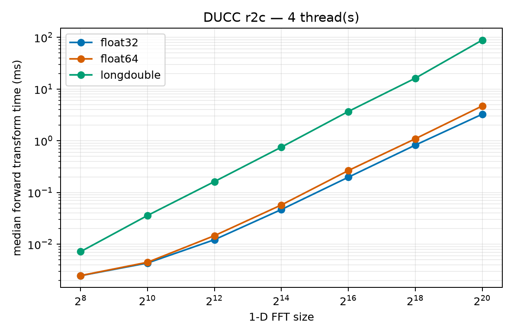</a> | <a href="results/fft/ubuntu-26.04-x86_64/c2c-threads-4.png">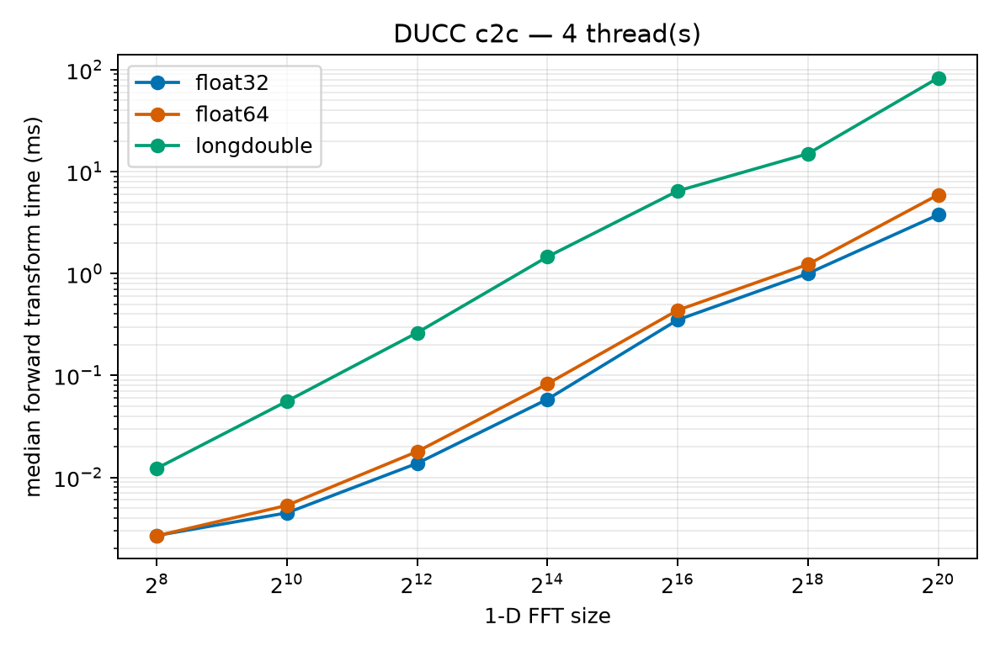</a> |

#### GitHub-hosted Ubuntu ARM64 26.04 runner

[Full ARM64 FFT results](results/fft/ubuntu-26.04-arm64/README.md)

| r2c                                                                                                                                                                    | c2c                                                                                                                                                                    |
| ---------------------------------------------------------------------------------------------------------------------------------------------------------------------- | ---------------------------------------------------------------------------------------------------------------------------------------------------------------------- |
| <a href="results/fft/ubuntu-26.04-arm64/r2c-threads-4.png">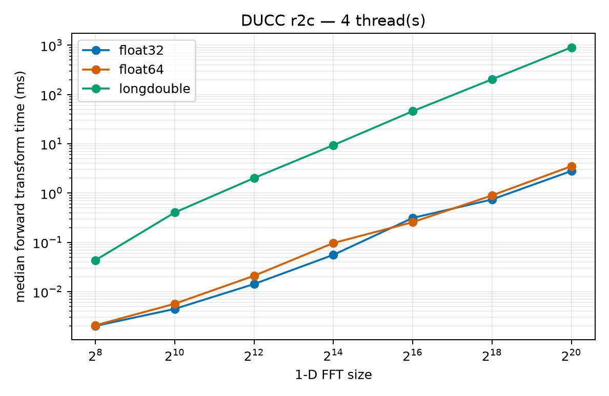</a> | <a href="results/fft/ubuntu-26.04-arm64/c2c-threads-4.png">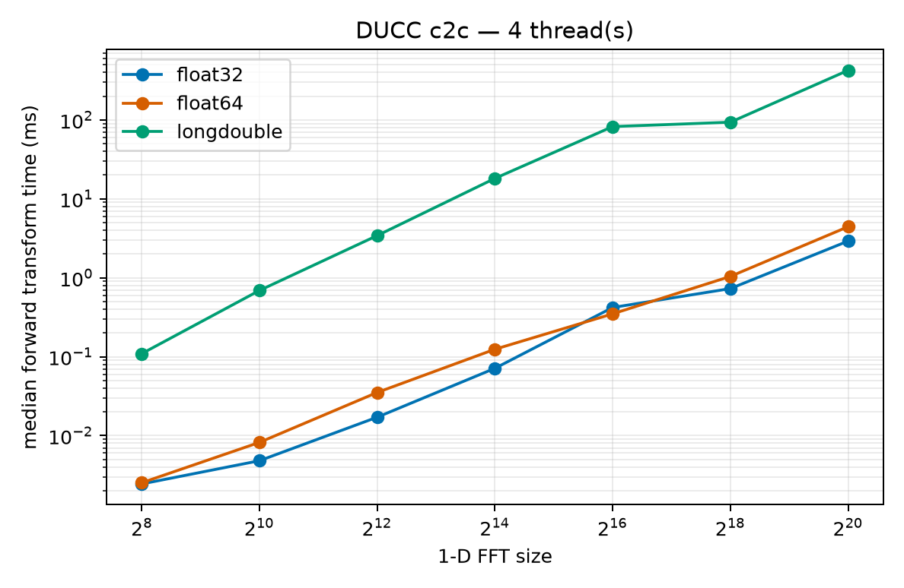</a> |

### SHT

Median transform time is shown in milliseconds; lower is better. Backend colors are fixed across figures. Wheel/installed builds use solid lines and source builds use dashed lines. SHTns is source-built and shown once as a dashed series.

#### AMD64 — AMD Ryzen 9 5950X, 16 threads

[Full AMD64 plot matrix](results/matrix/plots/README.md)

| Grid | Analysis | Synthesis |
| --- | --- | --- |
| CC | <a href="results/matrix/plots/by-lmax/cc/analysis/threads-16.png">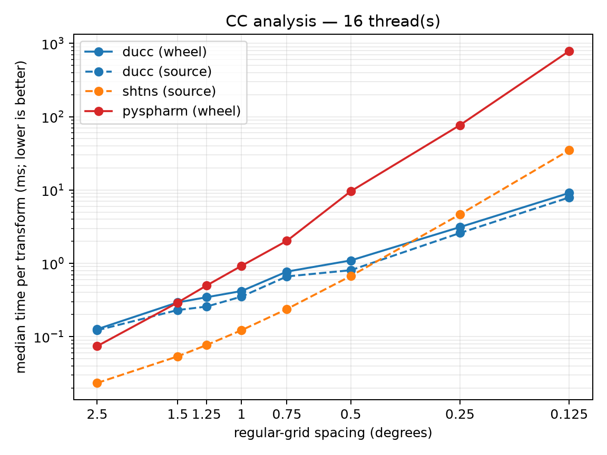</a> | <a href="results/matrix/plots/by-lmax/cc/synthesis/threads-16.png">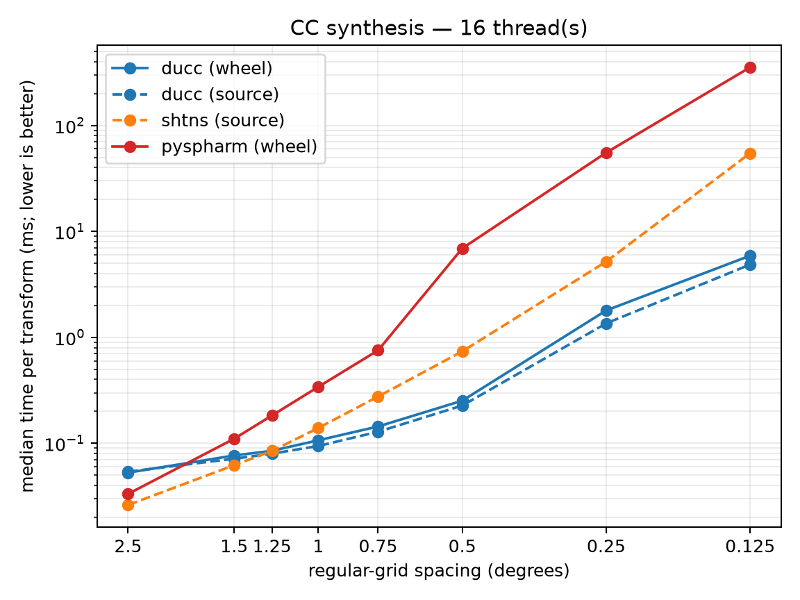</a> |
| GL | <a href="results/matrix/plots/by-lmax/gl/analysis/threads-16.png">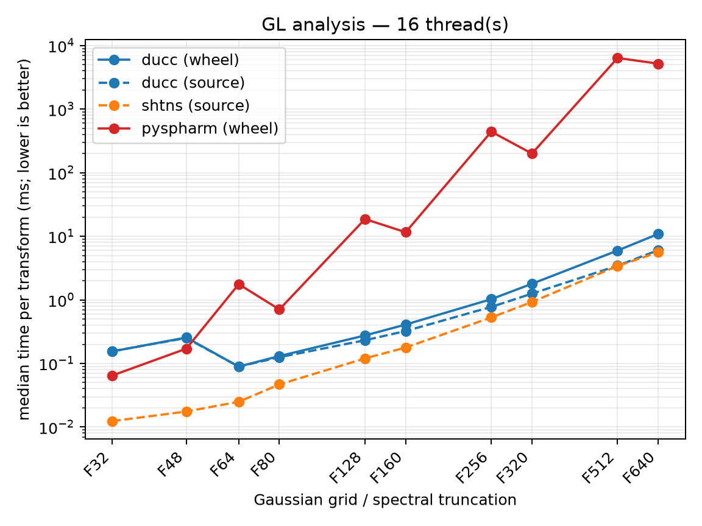</a> | <a href="results/matrix/plots/by-lmax/gl/synthesis/threads-16.png">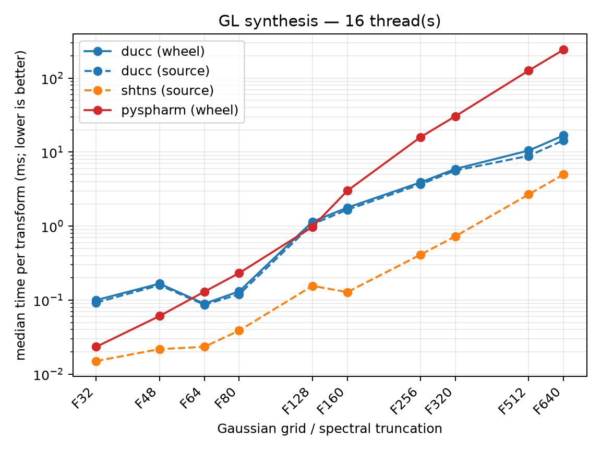</a> |

#### ARM64 — Raspberry Pi 5 8GB, 4 threads

[Full ARM64 plot matrix](results/matrix-arm64/plots/README.md)

| Grid | Analysis | Synthesis |
| --- | --- | --- |
| CC | <a href="results/matrix-arm64/plots/by-lmax/cc/analysis/threads-4.png">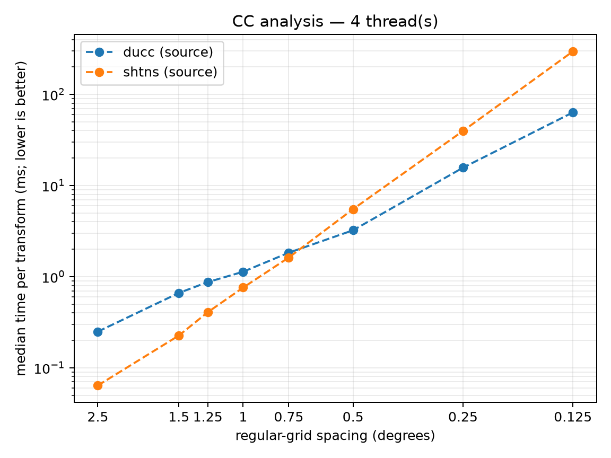</a> | <a href="results/matrix-arm64/plots/by-lmax/cc/synthesis/threads-4.png">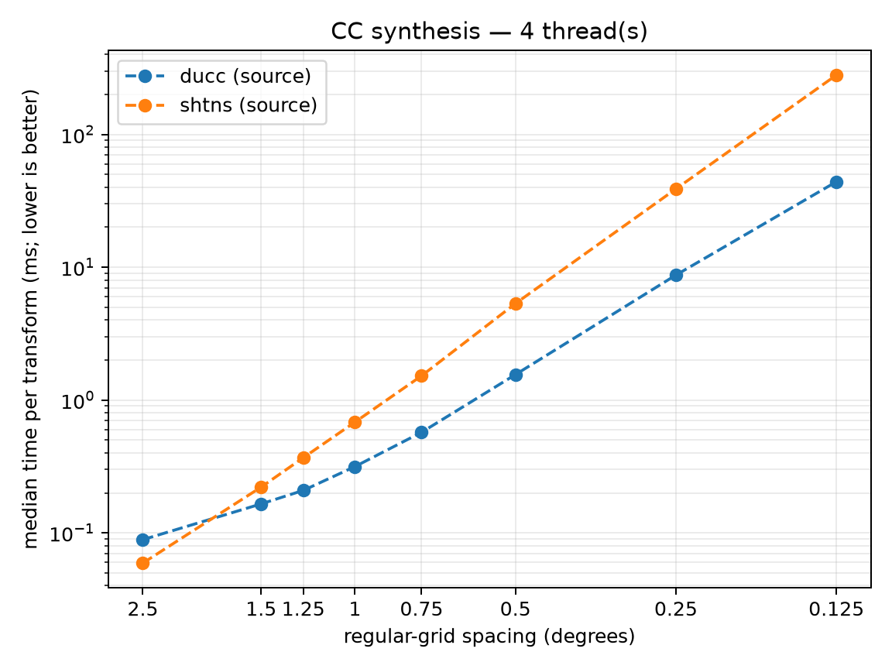</a> |
| GL | <a href="results/matrix-arm64/plots/by-lmax/gl/analysis/threads-4.png"></a> | <a href="results/matrix-arm64/plots/by-lmax/gl/synthesis/threads-4.png">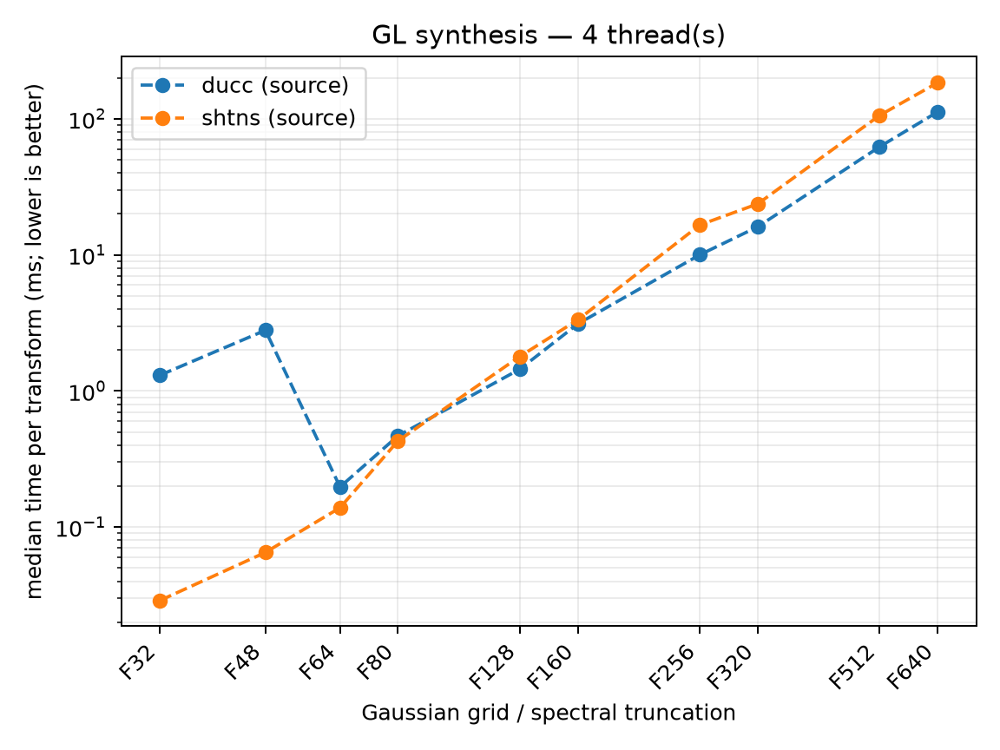</a> |

The two systems are separate benchmark environments; these panels are not intended as a direct cross-architecture speed comparison.

## Benchmark grids

The default GL sweep uses ten full atmospheric Gaussian grids. `F` is half the latitude count, so the full grid is `2F × 4F`. Gaussian latitudes are nonuniform; the spacing column is the nominal mean latitude spacing.

| GL label | Spectral truncation | `lmax` | Grid | Nominal spacing |
| --- | --- | ---: | ---: | ---: |
| F32 | T42 | 42 | 64 × 128 | 2.8125° |
| F48 | T63 | 63 | 96 × 192 | 1.875° |
| F64 | T85 | 85 | 128 × 256 | 1.40625° |
| F80 | TL159 | 159 | 160 × 320 | 1.125° |
| F128 | TL255 | 255 | 256 × 512 | 0.703125° |
| F160 | TL319 | 319 | 320 × 640 | 0.5625° |
| F256 | TL511 | 511 | 512 × 1024 | 0.3515625° |
| F320 | TL639 | 639 | 640 × 1280 | 0.28125° |
| F512 | TL1023 | 1023 | 1024 × 2048 | 0.17578125° |
| F640 | TL1279 | 1279 | 1280 × 2560 | 0.140625° |

The default CC sweep uses common equal-angle resolutions with both poles included and no duplicate 360° longitude column.

| CC resolution | `lmax` | Grid |
| ---: | ---: | ---: |
| 2.5° | 36 | 73 × 144 |
| 1.5° | 60 | 121 × 240 |
| 1.25° | 72 | 145 × 288 |
| 1.0° | 90 | 181 × 360 |
| 0.75° | 120 | 241 × 480 |
| 0.5° | 180 | 361 × 720 |
| 0.25° | 360 | 721 × 1440 |
| 0.125° | 720 | 1441 × 2880 |

For CC, `nlat = 2L + 1`, `nlon = 4L`, and the angular spacing is `90/L` degrees. A custom GL `lmax` outside the atmospheric table uses the compact quadrature geometry `nlat = L + 1`, `nlon = 2L + 1`.

## Direct DUCC/torch-harmonics comparison

The focused `compare` command measures direct `ducc0.sht` and
`torch-harmonics` scalar analysis and synthesis with separate accuracy and
steady-state timing records:

```bash
uv run sht-bench compare \
  --backend ducc,torch \
  --case cc-73x144-t70,cc-73x144-t71 \
  --dtype float32,float64 \
  --operation analysis,synthesis \
  --threads 1,16 \
  --torch-device cpu,cuda \
  --torch-source /path/to/torch-harmonics \
  --output results/torch-ducc
```

The command writes `results/torch-ducc.json` (the authoritative rich result)
and `results/torch-ducc.csv` (a flattened convenience view). It requires the
named local torch-harmonics source checkout; the imported module path and Git
SHA are verified and recorded, so a released wheel is not silently reported as
the feature branch. The checkout used while developing this comparison was
`feature/high-bandwidth-equiangular-sht` at
`fa1af8ddc2d9462fb69d2f9ffaf49be6284e9e7b`.

This comparison does not redefine the historical `matrix --grid cc` results.
Those results retain `nlat = 2*lmax + 1`, `nlon = 4*lmax` for each legacy cell.
The focused cases name fixed grids and inclusive triangular bandwidths:
`cc-73x144-t36`, `cc-73x144-t70`, `cc-73x144-t71`, `cc-129x256-t127`, and
`cc-257x512-t255`. `t36` is the low-bandwidth control; its Torch analysis is
reported for both `quadrature` and `sampling-theorem`. The high-bandwidth
analysis result uses `sampling-theorem` explicitly. In `sht_bench`, `lmax` and
`mmax` are inclusive mathematical limits; Torch receives `lmax=L+1` and
`mmax=L+1`.

Accuracy uses one deterministic rectangular `(ell, m)` coefficient field for
both backends, DUCC's synthesized map as the common analysis input, direct
cross-backend synthesis and analysis metrics, and separate same-backend
round-trip diagnostics. The four low-degree `Y00`, `Y10`, `Y11` real, and
`Y11` imaginary modes are calibrated before random spectra. Analysis and
synthesis retain relative L2, maximum absolute, and dtype-scaled bounded
relative errors.

## Run the benchmark

On Debian/Ubuntu, SHTns requires FFTW and Python development headers in addition to the compiler toolchain:

```bash
sudo apt-get install build-essential gfortran libfftw3-dev python3-dev
uv sync --all-extras
```

Run the full wheel/source matrix and generate plots:

```bash
uv run --extra plot sht-bench matrix \
  --build both \
  --threads 1,2,4,8,16 \
  --output results/matrix \
  --plot
```

For ARM64, a focused DUCC/SHTns run is:

```bash
uv run --extra plot sht-bench matrix \
  --build both \
  --backend ducc,shtns \
  --threads 1,2,4 \
  --output results/matrix-arm64 \
  --plot
```

## Method

The benchmark uses triangular truncation with `mmax = lmax`. Backend construction, grid setup, and reusable precomputation occur before timing. Each transform is warmed up and repeatedly timed with `time.perf_counter_ns`; raw samples and summary statistics are retained. Thread-count cells run in separate Python processes so thread-related environment variables are set before numerical libraries are imported.

DUCC and SHTns use double-precision spatial and spectral data. The public pyspharm interface uses `float32` spatial data and `complex64` coefficients, so its timings are a mixed-precision comparison. pyshtools and pyspharm do not expose the same explicit per-call thread control used by DUCC and SHTns. Passing tests or completing a timing run is not a cross-backend numerical validation of normalization, phase conventions, or transform accuracy.

See [BUILD.md](BUILD.md) for package/build provenance and [docs/MATRIX.md](docs/MATRIX.md) for matrix dimensions, incremental reruns, output files, and plotting details.
